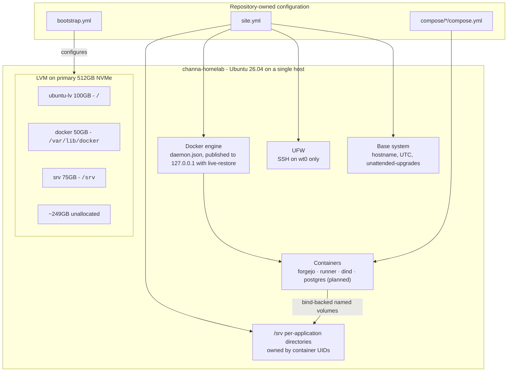
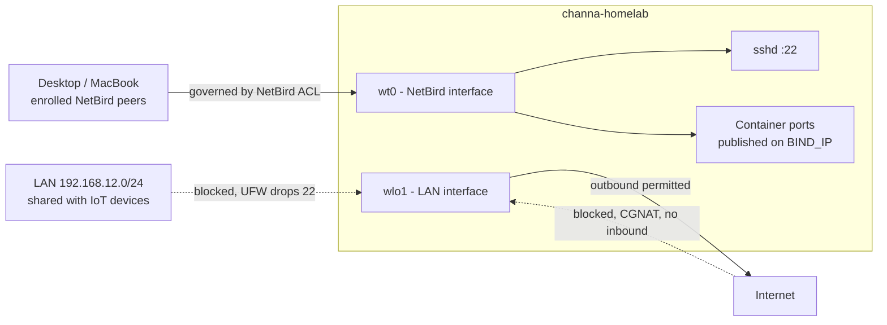

# Homelab! 

This repository houses the IaC configuration files and planning for my homelab, which is currently managed using [Docker Compose](https://docs.docker.com/compose/) and [Ansible](https://docs.ansible.com/#get_started). Ansible handles the machine setup, including storage configuration, firewall configuration, and the logical volumes for services managed by Docker Compose. Docker Compose manages the container configuration. This project is not mature, and will require considerable work to approach its final configuration.

## Contents

| Section | Contents | 
|---|---|
| [Overview]() | Architecture, repository layout |
| [Hardware]() | Current machine, available hardware |
| [Security posture]() | Threat model, access paths, and hardening measures |
| [Getting started]() | Prerequisites, the bare-metal build, and operating guide |
| [Services]() | A status table of available services |
| [Configuration & secrets]() | .env conventions and .gitignore |
| [Backup & restore]() | Backup system design overview and the restoration procedure |
| [Design decisions]() | Overview of the ADR indexes and pointers to additional docs |
| [Roadmap]() | Planned future additions, architecture changes, and so on |

## Overview

### Architecture

The files in this repository are used to configure and maintain the settings on the single host machine. The relationships between these configuration files and the configuration of the host is shown in the diagram below:



Docker Compose was chosen for the ease of setup. The desired end state (K8s with Gitops configuration) will differ significantly from the relationships shown above.

### Repository Layout

The directory layout for this repository is shown in the diagram below:

```
.
├── ansible
│   ├── files
│   │   └── daemon.json
│   ├── tasks
│   │   ├── base.yml
│   │   ├── docker.yml
│   │   ├── firewall.yml
│   │   └── srv-layout.yml
│   ├── ansible.cfg
│   ├── bootstrap.yml
│   ├── inventory.yml
│   ├── README.md
│   ├── requirements.yml
│   └── site.yml
├── compose
│   ├── forgejo
│   │   └── compose.yml
│   ├── postgres
│   │   ├── initdb.d
│   │   └── compose.yml
│   └── README.md
├── docs
│   ├── adr
│   │   └── 0001-bind-backed-named-volumes.md
│   ├── postgres.md
│   └── services.md
├── src
│   └── homelab
│       └── __init__.py
├── pyproject.toml
├── README.md
└── uv.lock
```

The project is currently split into three primary folders: 

- [ansible](ansible/), which contains the Ansible playbooks and configuration for machine setup
- [compose](compose/), which contains the Docker image configurations for the repository
- [docs](docs/), which contains [ADR files](docs/adr/) and general documentation

## Hardware

The homelab currently consists of a single Lenovo Thinkcentre 920Q thin client with 16GB of DDR4 RAM and a 512GB NVME SSD. The processor is an Intel i7-8700T, a low-wattage processor with 6 cores and 12 threads. In the future I'll likely add more Lenovo thin clients for symmetry, low power consumption, and because they're the cheapest hardware on Ebay. This isn't strictly needed for the project to function or add more services, but does enable fun K8s and hardware rack configuration options. 

Other hardware that I may incorporate includes:

### An old Dell XPS 13

A still-operational but dessicated Dell XPS 13 from 2017. The machine has 8GB of DDR4 RAM and a 256GB drive, but lacks an ethernet port, and is currently missing a TPM Device likely due to an expired CMOS battery. The CMOS battery and the primary device battery would both need to be replaced before the machine could be reused, but the backup power supply and convenient screen and keyboard could make it useful as an orchestration host.

### A pair of Odroid C2 units

The Odroid C2 units have 2GB of DDR3 memory and no native storage. They have never been used, but would be ideal for hosting small network services (e.g. PiHole) and experimenting with mixed architecture configurations in a K8s cluster. Because their use may require me to furnish either additional MicroSD cards or an external NVME SSD, these devices may not be cost effective to repurpose.

## Security posture

The full security posture on this setup is still being established. Remote server access is currently restricted to devices enrolled in a [Netbird](https://docs.netbird.io/get-started) mesh. Netbird enables a fully zero-trust security configuration, with no remote access to the machine except through the mesh network. Outbound connections are still permitted. 

Because Netbird's mesh network is extremely difficult to defeat, this configuration accepts the following risks: 
 
- `connor` functionally has passwordless root in order to enable Docker Compose functionality
- The CI runner for Forgejo Actions runs with `privileged: true` and presents a serious escape risk if compromised
- No secrets managers or backups have been configured

A diagram of the current access procedure for the project is included below:



### Planned security changes

The project currently resides on a CGNAT network, and will require DDNS over IPv6 and/or a Cloudflare tunnel in order to expose applications to the open internet. Because these requirements are also compliant with security and networking best practices, they do not represent a substantial impediment to the progress of the project. 

Once the services are functional and the container-to-container network is established, I plan on exploring the following changes:

- A [Cloudflare tunnel](https://developers.cloudflare.com/tunnel/) for public domain access, since the network this project is linked to uses CGNAT
- Adding [fail2ban](https://github.com/fail2ban/fail2ban) to prevent brute-force port scanner attacks
- Geoblocking for anyone outside Texas
- [Traefik](https://traefik.io/traefik), [Nginx](https://nginx.org/), or [Caddy](https://caddyserver.com/) for HTTPS hosting
- Direct scope-limited TCP connection for *some* Postgres backends and the homelab itself

## Getting started

### Building from bare metal

To start a clean setup, perform the following steps: 

1. Boot [Ubuntu Server 26.04](https://ubuntu.com/download/server) or the latest LTS version
2. Copy the SSH key for your remote workstation onto the drive
3. Install and enroll Netbird on the server
4. Verify connectivity using `cd ansible && ansible all -m ping`
5. Build the storage layer using `ansible-playbook bootstrap.yml --tags bootstrap -K`
6. Apply the host configuration using `ansible-playbook site.yml --diff -K`
7. Log out and log back in to apply Docker group membership
8. Clone the repository onto the server for the Docker Compose files
9. In each `compose/` subdirectory, run `docker compose up -d`

### Operating guide

See [ansible/README.md](ansible/README.md) and [docker/README.md](docker/README.md) for details.


## Services

| Service | Status | Docs |
|---|---|---|
| Forgejo and Forgejo Actions | Running | [compose/README.md](compose/README.md#forgejo) |
| Postgres | Designed, not deployed | [docs/postgres.md](docs/postgres.md) |
| Prefect | Planned | [docs/services.md](docs/services.md) |

## Configuration & secrets

TODO!
intro — two layers, what is committed vs not

| Service | Variable | Secret |
|---|---|---|
| Forgejo | `FORGEJO_DOMAIN` | The domain used in clone URLs. |
| Forgejo | `BIND_IP` | Currently the Netbird mesh address of the host device. |
| Postgres | `BIND_IP` | Currently the Netbird mesh address of the host device. |
| Postgres | `POSTGRES_SUPERUSER_PASSWORD` | Superuser. |
| Postgres | `{service}_DB_PASSWORD` | Per-service, consumed on first-boot init. |

### Environment files

the .env / .env.example convention + per-stack table + BIND_IP callout

### Secrets outside .env

runner token, SSH key

### Current limitations

no secrets manager, missing postgres .env.example, vault/SOPS unused

## Backup & restore

Backups will be via Restic using remote storage hosted on Backblaze or AWS S3. Ideally these backups will be automated by a Github Actions runner associated with this repository, which will (end state) be run by the Github Actions server hosted on the homelab system.

### Disaster recovery

First, perform a fresh installation of Ubuntu Server. 

Then, to apply the Ansible playbooks located in this repository, use the following commands from the [`ansible/`](ansible/) folder: 

```bash
cd ansible

# Can we reach the machine? 
ansible all -m ping

# Storage rebuild. Requires the explicit tag.
ansible-playbook bootstrap.yml --tags bootstrap -K

# Apply the diff in configuration specs 
ansible-playbook site.yml --diff -K
```

This will restore the machine to the network, drive, and other settings specified by this repository. Note that running the bootstrap playbook can rewrite `/etc/fstab`, and could cause next-book failure for services. For more information, see the [Ansible configuration README.](/ansible/README.md)

Once the Ansible configuration has been established, the Docker daemon will start and the machine will boot the appropriate services. Because storage currently does not contain any critical information, backups haven't been configured. Once backups are configured, the backup restoration procedure will be detailed here.

## Design decisions

```
docs
├── adr
│   └── 0001-bind-backed-named-volumes.md
├── postgres.md
└── services.md
```

ADR documentation and other documents are located in the [docs/](docs/) folder. ADR files are grouped in [docs/adr/](docs/adr/), and assorted documentation for future services, previous decisions, etc. is stored in the primary directory. 

## Roadmap

### Kubernetes

A future migration to [Kubernetes](https://kubernetes.io/docs/home/) is planned but is currently not implemented. Kubernetes migration details are partially addressed in the Docker and Ansible README files for this repository.

### Self-Hosted Spark

[Apache Spark](https://spark.apache.org/docs/latest/running-on-kubernetes.html) is a framework for distributed compute on large-scale data workloads. While the overwhelming majority of companies probably lack the volumes required to make Spark the obvious choice over a single-node tool like [DuckDB](https://duckdb.org/docs/current/) or [Polars](https://docs.pola.rs/), it remains the 'professional standard' for numerous data engineering workloads. Because I think it would be a pretty cool learning project to self-host it on my own infrastructure and run test jobs using publically available data, I could build a 'proof of concept' for fun.
